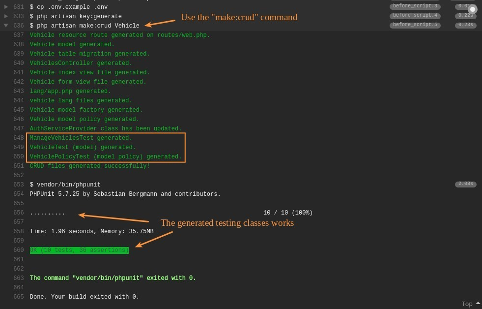

<h1 align="center">Laravel Simple CRUD Generator Usage Example</h1>

### About
This is laravel 5.3 application demo for [**Simple CRUD Generator**](https://packagist.org/packages/luthfi/simple-crud-generator) package usage.

### Usage Example
Travis CI build result on generated Testing Classes by [Simple CRUD Generator](https://packagist.org/packages/luthfi/simple-crud-generator) package :

This laravel application demo is open-sourced software licensed under the [MIT license](LICENSE).
